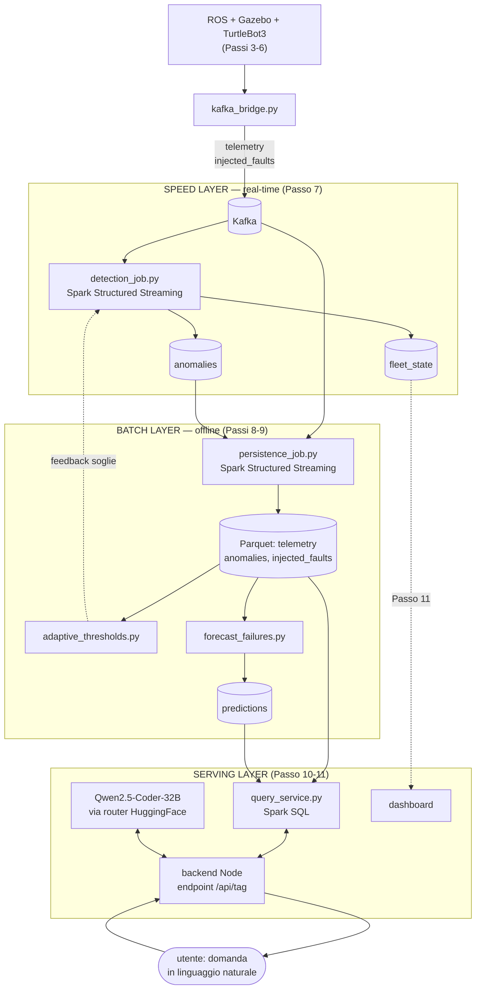

# Passo 10 — Layer TAG (text-to-SQL, LLM)

**Obiettivo:** endpoint Node: prompt (schema intero + few-shot) → Qwen su HuggingFace → SQL → esecuzione sui Parquet → righe. Guardia: solo `SELECT` + retry sull'errore. ~20-30 domande di riferimento per la valutazione.
**Deliverable atteso:** "chiedi a parole → risposta dai dati".

Quarta e ultima delle tecnologie richieste dal corso (Kafka, Spark, previsione time-series, LLM — tutte e quattro presenti a questo punto). Rispetto al piano originale, due decisioni prese prima di implementare:

1. **Niente DuckDB.** Il piano originale prevedeva `duckdb` (libreria Node embeddable) per eseguire l'SQL generato direttamente nel backend. Deciso di sostituirlo con **Spark SQL**, riusando il cluster già in piedi dai Passi 7-9 invece di aggiungere un nuovo motore. Il backend Node non esegue più l'SQL da solo: chiama un piccolo servizio Spark dedicato (`query_service.py`) via HTTP interno.
2. **Qwen-Coder via il router di Hugging Face (Inference Providers), non self-hosted.** Il piano non specificava se ospitare il modello in locale o chiamarlo via API. Scelto di riusare esattamente il pattern già rodato in un altro progetto dell'utente (endpoint `https://router.huggingface.co/v1/chat/completions`, formato OpenAI-compatibile, Bearer token) — evita di dover gestire GPU/quantizzazione/`nvidia-container-toolkit` nel container, molto più leggero e riproducibile. Modello usato: `Qwen/Qwen2.5-Coder-32B-Instruct:fastest` (verificato disponibile tramite gli Inference Providers, provider Nscale al momento).

## Architettura

Con queste due scelte, la pipeline del progetto acquista la forma di una **architettura lambda**: gli stessi dati grezzi (`telemetry` su Kafka) alimentano sia un percorso *real-time* a bassa latenza (Passo 7, per la dashboard) sia un percorso *batch* più lento ma completo (Passi 8-10, per analisi storiche e query ad-hoc) — con un layer di servizio che li espone entrambi.



Il layer TAG (questo passo) vive interamente nel **serving layer**: interroga solo lo storico Parquet della batch layer, mai lo stream diretto — coerente con l'idea che "a parole" si interroga cosa è già successo, non l'istante presente (quello lo fa già la dashboard via `fleet_state`, Passo 11).

## Cosa è stato costruito

**`streaming/query_service.py`** — processo Spark persistente (non `spark-submit` per query: costerebbe ~10s di avvio JVM ad ogni domanda, inaccettabile per un endpoint interattivo). Un server HTTP minimale (`http.server`, niente Flask: evita una dipendenza in più per due sole route) espone:
- `GET /health`
- `POST /query {"sql": "..."}` → ricrea le temp view sulle 4 cartelle Parquet (economico: è solo discovery dello schema finché non scatta un'azione, così vede sempre i dati più recenti scritti da `persistence_job.py`), valida che sia una sola `SELECT`/`WITH` senza parole chiave di scrittura (`INSERT`/`DROP`/... — stessa guardia del backend Node, difesa in profondità), esegue con `spark.sql(...).limit(500)` e ritorna righe JSON.

**`backend/src/services/LlmService.js`** — client per il router HuggingFace, adattato da un pattern già in uso in un altro progetto dell'utente (stessa struttura, portato a ES modules).

**`backend/src/services/promptBuilder.js`** — costruisce i messaggi per il LLM: schema completo delle 4 tabelle (inclusi i dettagli di dialetto Spark SQL rilevanti — accesso a STRUCT con la dot notation, `array_contains` per gli ARRAY, `timestamp_millis` per i timestamp epoch), 5 esempi few-shot, regole esplicite (solo `SELECT`, nessuna spiegazione, `LIMIT` ragionevole se non specificato).

**`backend/src/services/sqlGuard.js`** — `extractSql` (ripulisce eventuali blocchi markdown che il modello potrebbe comunque aggiungere) e `validateSelectOnly` (stessa logica lato Node, prima ancora di contattare `query_service`).

**`backend/src/services/tagService.js`** — orchestra il ciclo: prompt → LLM → guardia → esecuzione; se la guardia rifiuta la query o l'esecuzione fallisce, **un retry**, ri-prompting il modello con l'errore ricevuto, poi restituisce il risultato o l'errore finale.

**`backend/src/routes/tag.js` + `server.js`** — `POST /api/tag { "question": "..." }`.

**Credenziali**: `backend/src/config/HuggingFace_credentials.json` (gitignored, con un file `.example.json` committato come template) — per ora riusa **lo stesso token** di un altro progetto di riferimento, da sostituire con un token dedicato in seguito.

## Problema incontrato: worker Spark disconnesso dal master

Durante il wiring ho dovuto ricreare il container `spark-master` (per applicare la nuova porta `5000:5000` nel `docker-compose.yml`). `spark-worker`, già in esecuzione e connesso al master precedente, non si è riconnesso automaticamente al nuovo container (stesso nome DNS `spark-master`, ma identità di rete diversa dopo la ricreazione) — è rimasto con una connessione Netty verso un host ormai inesistente. Sintomo: `query_service.py` restava bloccato con `WARN TaskSchedulerImpl: Initial job has not accepted any resources`, perché il master lo vedeva in stato `WAITING` con **zero worker vivi** (`aliveworkers: 0` nell'API JSON di `http://localhost:8080/json/`). Fix: ricreare anche `spark-worker` per fargli ri-risolvere `spark-master` da capo. Da tenere presente in generale: in un cluster Spark standalone su Compose, ricreare il master richiede quasi sempre di ricreare anche i worker.

## Verifica

### 1. Guardie SQL in isolamento

8 controlli su `extractSql`/`validateSelectOnly` (Node, via `node -e`): `SELECT` accettata, blocco markdown ripulito correttamente, `DROP`/`INSERT` rifiutate, query con `;` in mezzo rifiutata (previene SQL impilate), `WITH ... SELECT` accettata, query vuota rifiutata, e — controllo mirato — `SELECT created_at FROM telemetry` **accettata** (il controllo sulle parole chiave vietate usa confini di parola, altrimenti "created_at" farebbe scattare per errore il blocco su `CREATE`). Tutti verificati.

### 2. Pipeline reale end-to-end

Con `query_service.py` attivo e connesso, 5 domande reali in italiano poste a `POST /api/tag`, **tutte risolte al primo tentativo** (nessun retry necessario):

| Domanda | SQL generato (riassunto) | Esito |
|---|---|---|
| "Quanti messaggi di telemetria ci sono per ciascun robot?" | `GROUP BY robot_id` su `telemetry` | R1: 16767, R3: 3981, R2: 1027, + i robot di test |
| "Quali guasti di tipo deriva_termica... e su quale robot?" | filtro su `injected_faults.fault_type` | F1 su R1 e su R3 (due run distinte, Passi 6 e 9) |
| "Previsioni con il lead time più basso" | `ORDER BY lead_time_s ASC` su `predictions` | le due previsioni reali del Passo 9 (ARIMA e regressione lineare, stesso segnale) |
| "Anomalie salute per motor_current, per robot" | `array_contains(threshold_reasons, 'motor_current')` | vedi sotto |
| "Per ogni robot con guasti iniettati, conteggio guasti e temperatura media" | CTE + `JOIN` fra `injected_faults` e `telemetry` | R1: 5 guasti, 35.0°C medi; R3: 2 guasti, 38.4°C medi |

La quarta domanda ha fatto emergere un dettaglio interessante dello storico reale: `robot_id` risultava `null` per le anomalie `motor_current` più vecchie. Non un bug nuovo — verificato ordinando per `ts` che le righe con `robot_id` presente sono tutte **successive** al fix del Passo 7 (il bug per cui `robot_id` restava solo nella key Kafka, non nel payload), mentre le più vecchie risalgono a *prima* di quel fix. Il layer TAG ha semplicemente esposto fedelmente un artefatto storico reale già noto — buona controprova che funziona onestamente sui dati così come sono, senza nasconderne le imperfezioni.

La quinta domanda (CTE con due sotto-query e una `JOIN`) dimostra che il modello generalizza oltre gli esempi few-shot (nessuno dei 5 esempi nel prompt usa `JOIN` o più di una CTE).

## Stato

- `streaming/query_service.py` — nuovo, in esecuzione persistente (lasciato attivo: il layer TAG ne dipende, come `backend`/`kafka` resta un servizio sempre su, non un job lanciato e fermato come i job Passo 7-9).
- `backend/src/services/{LlmService,promptBuilder,sqlGuard,tagService}.js` — nuovi.
- `backend/src/routes/tag.js`, `backend/src/server.js` — nuovo endpoint `/api/tag`.
- `backend/src/config/HuggingFace_credentials.{json,example.json}` — la prima gitignored.
- `docker-compose.yml` — porta `5000` esposta su `spark-master`, `QUERY_SERVICE_URL` sul `backend`.
- `.gitignore` — aggiunta la nuova entry per le credenziali.

Comando per rilanciare `query_service.py` se il container viene ricreato:

```bash
docker exec -d shf-spark-master bash -c "
  /opt/bitnami/spark/bin/spark-submit --master spark://spark-master:7077 \
    /opt/shf/streaming/query_service.py > /tmp/query_service.log 2>&1"
```

## Aggiornamento (2026-07-21): il terzo stadio mancante — da text-to-SQL a TAG vero

Vale la pena chiedersi se fosse corretto chiamare questo layer "TAG", o se fosse un'etichetta troppo ambiziosa per quello che il codice faceva davvero. Risposta onesta dopo aver riletto `tagService.js`/`dashboard/app.js`: **no**, non lo era. La definizione di TAG (Biswal et al., *"TAG: A Unified Framework for Table-Augmented Generation"*, 2024) richiede tre stadi — query synthesis, query execution, **answer synthesis** (l'LLM rielabora le righe in una risposta) — e questo layer si fermava al secondo: restituiva SQL generato e righe grezze in una tabella HTML, senza alcuna rielaborazione. Un vero sistema di text-to-SQL, non di TAG, nonostante fosse già chiamato "TAG" fin dal piano originale — un'imprecisione di terminologia presente dall'inizio, non introdotta ora.

Aggiunto lo stadio mancante:
- **`backend/src/services/promptBuilder.js`** — nuova `buildAnswerSynthesisMessages(question, sql, rows)`: prompt con domanda + SQL eseguita + righe risultato (troncate a 30 per non gonfiare il prompt, con avviso esplicito se il totale è maggiore), istruzione esplicita di rispondere solo in base ai dati forniti e di dichiarare "nessun risultato" invece di inventare (mitigazione diretta del rischio di allucinazione).
- **`backend/src/services/tagService.js`** — nuova `synthesizeAnswer(...)`: una seconda chiamata allo stesso `LlmService.js` (stesso modello, stesso token — nessuna nuova infrastruttura) dopo l'esecuzione della query, il cui risultato (`answer`) viene aggiunto all'oggetto restituito da `answerQuestion(...)`. Fallimento isolato con try/catch: se la sintesi fallisce (es. rate limit del router), l'utente riceve comunque SQL e righe, solo senza la frase in linguaggio naturale.
- **`dashboard/app.js`/`style.css`** — la risposta sintetizzata compare in un box evidenziato sopra la query SQL e la tabella grezza (che restano visibili, per trasparenza/debug). Aggiunto un piccolo `escapeHtml(...)` per non inserire testo LLM non sanificato in `innerHTML` (le righe della tabella, preesistenti, non erano già sanificate — non toccato per non allargare lo scope di questa modifica, ma la superficie più a rischio, il testo libero generato dal secondo LLM, ora lo è).

**Verificato con domande reali** (non solo lette dal codice): risultato singolo ("qual è il robot con il lead time più corto?" → "Il robot con il lead time di previsione più corto è R3, con un lead time di 130 secondi."), nessun risultato ("quali robot hanno la batteria sotto il 5%?" → "Nessun risultato trovato per robot con batteria sotto il 5%.", non un'allucinazione), gruppo di righe (conteggio guasti per robot). Tutti e tre fedeli ai dati restituiti dalla query.

**Bug trovato durante la verifica, non correlato al nuovo stadio**: il primo test end-to-end è rimasto bloccato per minuti — causa identica a quella già documentata sopra ("Problema incontrato: worker Spark disconnesso dal master"), ripresentatasi perché in questa sessione `spark-master` era stato ricreato (per il rebuild dell'immagine backend) senza ricreare anche `spark-worker`. Stesso fix: `docker compose up -d --force-recreate spark-worker`. Non è un difetto della soluzione implementata, ma la riprova che questo problema si ripresenta ogni volta che si dimentica il passo — vale la pena tenerlo a mente come check di routine dopo qualunque ricreazione di `spark-master`.

**Nota di scopo dichiarata**: l'esperimento di valutazione (`eval/run_effectiveness.py`, Passo 13) misura solo l'accuratezza dei primi due stadi (le righe restituite contro l'SQL di verità) — non esiste ancora una metrica automatica per la fedeltà della risposta sintetizzata alle righe. Verificato finora solo a campione manualmente (sopra). Sviluppo naturale futuro, non necessario per dimostrare che lo stadio funziona.

## Prossimo passo

Passo 11 — Dashboard: frontend HTML + canvas 2D servito dal backend Node, che consuma `fleet_state` da Kafka via websocket per la vista live della flotta, con un pannello robot-a-rischio (da `predictions`) e la casella di query in linguaggio naturale verso l'endpoint `/api/tag` appena costruito.
