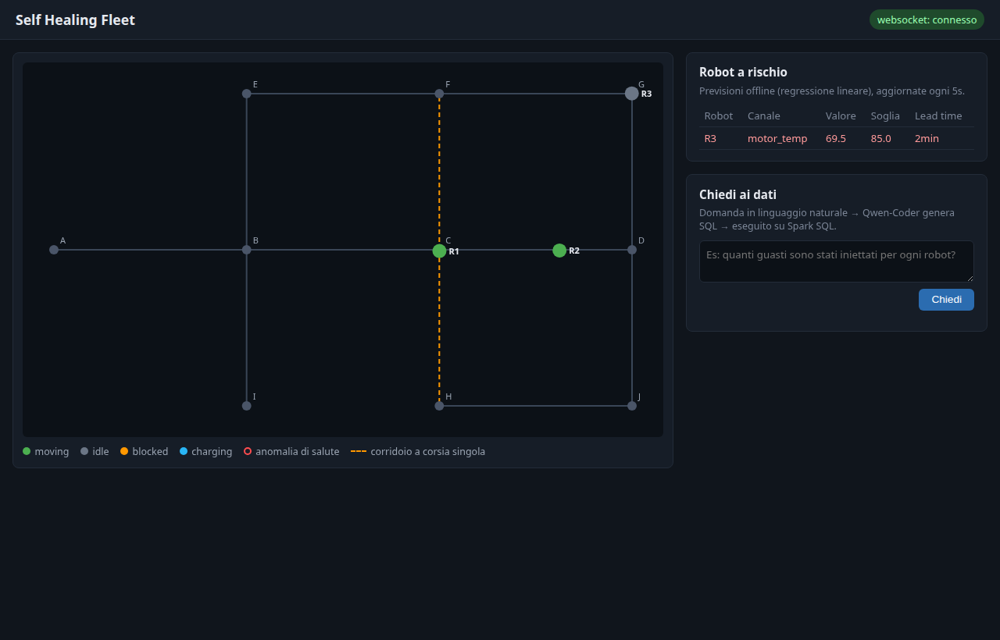
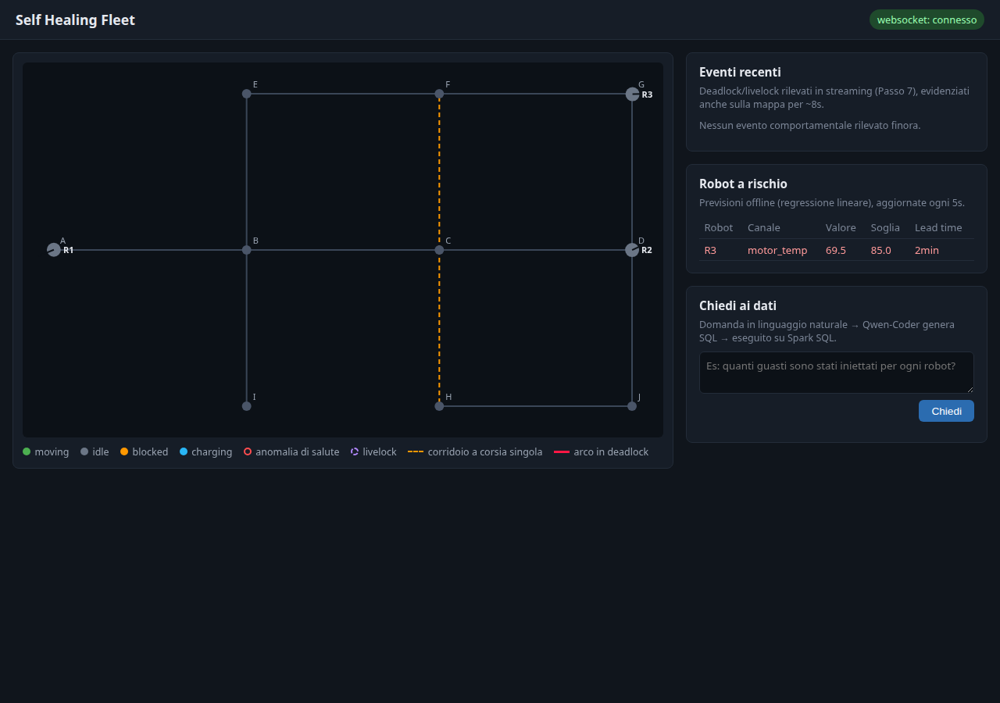
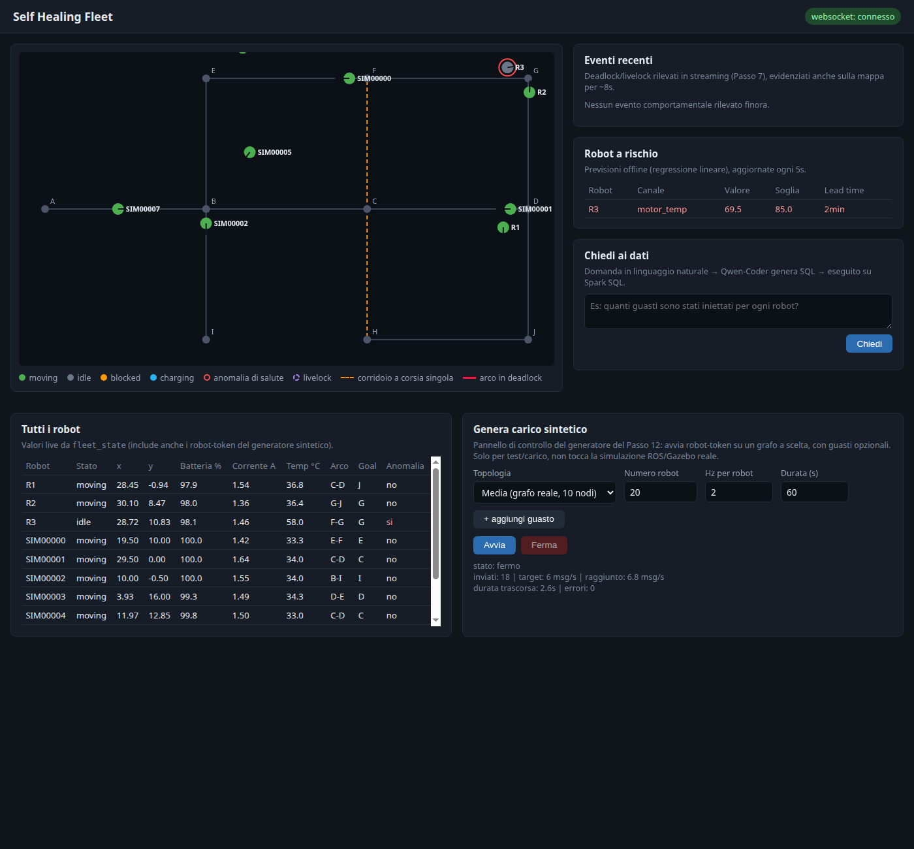
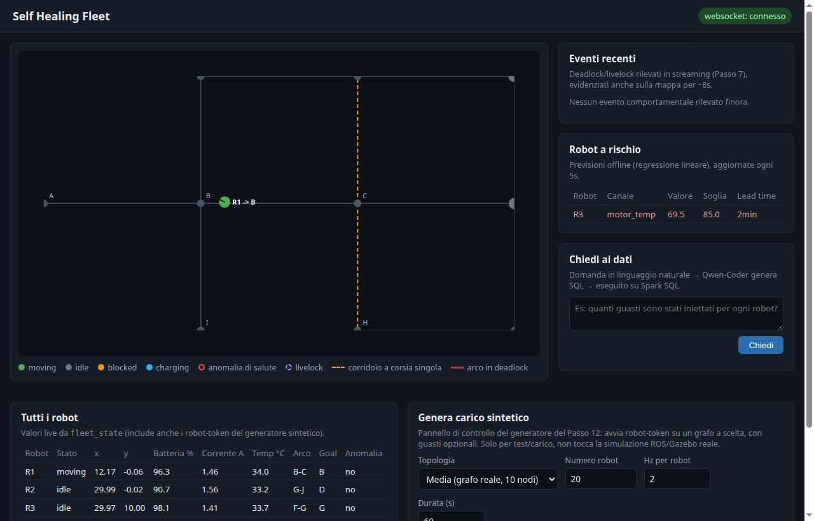
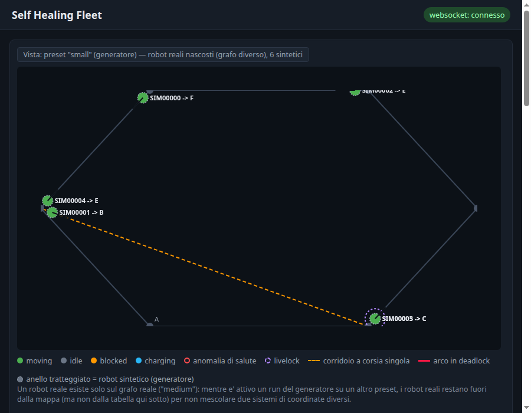

# Passo 11 — Dashboard

**Obiettivo:** frontend (HTML + canvas 2D + JS) servito dal backend Node. Il backend consuma `fleet_state` da Kafka e fa push in websocket; la pagina disegna la mappa a grafo e i robot live. Pannelli (incl. robot a rischio dalle previsioni) + casella di query NL verso l'endpoint TAG.
**Deliverable atteso:** vista live della flotta + interrogazione.

Ultimo passo che chiude il ciclo `real-time → offline → serving`: la stessa pagina mostra lo stato istantaneo dei robot (speed layer, Passo 7) e le previsioni di guasto (batch layer, Passo 9), e permette di interrogare lo storico a parole (serving layer, Passo 10) — vedi il diagramma lambda in `docs/passi/10-layer-tag.md`, che qui si completa con l'ultimo blocco (`Dashboard`).

## Cosa è stato costruito

**Backend (`backend/src/`)**
- **`services/fleetStateStore.js`** — nuovo consumer `kafkajs` sul topic `fleet_state`, con `groupId` univoco per processo (`shf-backend-dashboard-<timestamp>`): la dashboard vuole sempre l'ultimo stato, non un replay di un offset committato da un avvio precedente. Mantiene una `Map<robot_id, ultimo stato>` in memoria e notifica un set di listener ad ogni messaggio (nessuna persistenza: lo storico è già coperto da Parquet, Passo 8).
- **`services/queryService.js`** — estratto da `tagService.js` (Passo 10): client HTTP verso `query_service.py`, ora condiviso anche dalla nuova route `/api/predictions`.
- **Nuove route:** `GET /api/graph` (serve `config/warehouse_graph.json`, montato nel container in sola lettura), `GET /api/fleet` (snapshot corrente, utile al primo caricamento pagina prima che arrivi il primo messaggio websocket), `GET /api/predictions` (query fissa su Spark SQL: ultima previsione per `(robot_id, channel)` via `ROW_NUMBER() OVER (PARTITION BY ...)`, ordinata per `lead_time_s` crescente — i robot più a rischio in cima).
- **`server.js`** — passa da `app.listen` a un `http.Server` esplicito con un `WebSocketServer` (`ws`) agganciato su `/ws`: alla connessione invia uno snapshot completo, poi inoltra ogni nuovo `fleet_state` a tutti i client connessi. Serve anche i file statici di `dashboard/`.

**Frontend (`dashboard/`, nuovo)**
- **`index.html`** — pagina con canvas per la mappa, pannello "Robot a rischio" e casella di domande in linguaggio naturale.
- **`app.js`** — nessun framework (canvas 2D + JS puro, come da piano): carica il grafo da `/api/graph` e calcola una trasformazione lineare coordinate-magazzino → pixel (con flip sull'asse Y); apre il websocket e mantiene una mappa locale `robot_id → stato`; un loop `requestAnimationFrame` ridisegna grafo + robot ad ogni frame (i dati arrivano via websocket in modo asincrono, il redraw è indipendente e legge lo stato corrente). I robot sono colorati per `task_state` (verde=moving, grigio=idle, arancio=blocked, azzurro=charging) con un anello rosso se `health_anomaly`. Gli archi a corsia singola (`capacity=1`, i choke point deadlock/livelock del Passo 5) sono tratteggiati in arancio. Il pannello previsioni fa polling di `/api/predictions` ogni 5s, colorando le righe per urgenza (`lead_time_s`). La casella NL fa `POST /api/tag` (Passo 10) e mostra SQL generato + risultati in tabella.
- Riconnessione automatica del websocket (retry ogni 2s) se il backend viene riavviato.

**`docker-compose.yml`** — al servizio `backend`: volume `./config:/workspace/config:ro` (per `/api/graph`, stesso pattern già usato da `spark-master`/`spark-worker`) e `./dashboard:/app/dashboard:ro` (file statici, non ricopiati nell'immagine per poterli modificare senza rebuild), più le env `KAFKA_BOOTSTRAP` e `CONFIG_DIR`.

**`backend/package.json`** — aggiunte le dipendenze `kafkajs` (consumer) e `ws` (websocket server).

## Problema incontrato: contesa dei core Spark fra `query_service` e `detection_job`

Per verificare la dashboard dal vivo serve avere **contemporaneamente** attivi sia `query_service.py` (Passo 10, serving layer) sia `detection_job.py` (Passo 7, speed layer) sullo stesso cluster Spark standalone. Il worker unico ha 12 core; lo scheduler FIFO di Spark standalone assegna a un'applicazione **tutti** i core liberi al momento della registrazione se non le viene detto un limite esplicito. Risultato: il primo dei due job partito (`query_service`, già in esecuzione dal Passo 10) si è preso tutti e 12 i core, e `detection_job` è rimasto bloccato su `WARN TaskSchedulerImpl: Initial job has not accepted any resources`.

Fix: entrambi i job rilanciati con `--conf spark.cores.max` esplicito — `3` per `query_service` (interattivo, basso carico) e `8` per `detection_job` (tre query streaming concorrenti), lasciando margine sui 12 disponibili. Da tenere presente in generale: su un cluster Spark standalone condiviso da più job persistenti, va sempre fissato `spark.cores.max` su ciascuno, altrimenti il primo che parte affama gli altri.

## Verifica

Verifica end-to-end reale, non solo lettura del codice: simulazione multi-robot rilanciata (`roslaunch shf_bringup sim_multi_robot.launch`, come da Passo 5) insieme a `detection_job.py` e `query_service.py` attivi in parallelo (fix sopra), backend ricostruito con le nuove dipendenze.

1. **API REST**: `GET /api/graph` (nodi/archi del magazzino), `GET /api/fleet` (passato da `[]` a 3 robot reali con posizione/stato una volta partita la simulazione), `GET /api/predictions` (una previsione reale del Passo 9, es. `R3, motor_temp, lead_time_s=130`) — tutte verificate con `curl`.
2. **Websocket**: consumer Kafka connesso (log `[fleetStateStore] consumer Kafka connesso`), pagina aperta in un vero browser (Chromium headless via CDP, non solo lettura statica dell'HTML) — badge "websocket: connesso", stato dei 3 robot aggiornato in tempo reale sulla mappa canvas, colori coerenti con lo stato letto in parallelo da `/api/fleet` (es. R1 con anello rosso quando `motor_current=4.5A` > soglia 2.5A, sparito al giro successivo quando il valore è rientrato — l'anomalia iniettata dal `fault_schedule` visibile a schermo mentre succede).
3. **Pannello previsioni**: popolato con la previsione reale (`R3`, `motor_temp`, lead time ~2 minuti), riga colorata di rosso (rischio alto, `lead_time_s < 300`).
4. **Query NL end-to-end nel browser**: digitata "Quanti robot ci sono nella flotta?" nella casella, click su "Chiedi" → SQL generato (`SELECT COUNT(DISTINCT robot_id) AS n_robots FROM telemetry LIMIT 100`) mostrato ed eseguito, risultato `n_robots = 8` (conta anche i robot di test delle verifiche dei passi precedenti, presenti nello storico Parquet — corretto, la domanda riguardava tutto lo storico non solo la sessione corrente).
5. Nessun errore in console salvo il consueto 404 su `/favicon.ico` (nessun favicon servito, irrilevante).

Screenshot della pagina reale, presa durante questa verifica:



## Estensione: animazione fluida + anomalie comportamentali live sulla mappa

Dopo la prima verifica, due limiti emersi da un confronto con l'utente:

1. **Il canvas non animava i robot in modo continuo.** Il rendering disegnava solo l'ultima posizione ricevuta via websocket, che arriva al massimo ogni 2s (il trigger del micro-batch di `detection_job.py` per la query di salute, non un limite del websocket in se'). I robot "saltavano" da un punto all'altro invece di scorrere.
2. **Solo le anomalie di salute erano visibili sulla mappa** (l'anello rosso per robot, gia' presente). Le anomalie **comportamentali** (deadlock/livelock, Passo 7) finiscono sul topic Kafka `anomalies` ma la dashboard non lo consumava affatto — nessun modo di "vedere l'errore sul grafico" per quei due meccanismi.

**Fix 1 — dead reckoning lato client.** Il messaggio di telemetria ha gia' `v_lin`/`v_ang`/`theta` nello schema condiviso: `dashboard/app.js` ora calcola, ad ogni frame (`requestAnimationFrame`, ~60fps), una posizione stimata `x + v_lin*cos(theta)*dt` dall'ultimo pacchetto ricevuto invece di aspettare il prossimo — stessa tecnica di *client-side dead reckoning* usata nei giochi multiplayer per interpolare fra due stati di rete. L'estrapolazione e' limitata a 3s (oltre, l'ultima posizione nota e' troppo vecchia e si congela invece di continuare a proiettare all'infinito). Aggiunto anche un piccolo indicatore di direzione (segmento dal centro verso `theta`) cosi' la rotazione resta visibile anche quando la posizione cambia poco.

**Fix 2 — nuovo consumer per le anomalie comportamentali.** `backend/src/services/anomalyStream.js` (nuovo, stessa struttura di `fleetStateStore.js`): consumer `kafkajs` dedicato sul topic `anomalies`, filtra lato server tenendo solo `type in {deadlock, livelock}` (le anomalie `salute` restano coperte da `fleet_state.health_anomaly`, includerle di nuovo qui avrebbe solo duplicato/spammato il log). `server.js` inoltra ogni evento via websocket (`{type: "anomaly", anomaly: {...}}`). Sul frontend: l'arco in deadlock viene evidenziato in rosso acceso con una leggera pulsazione (`Math.sin`) per ~8s, i robot coinvolti (in deadlock o in livelock) prendono un anello tratteggiato distinto dall'anello di salute; un nuovo pannello **"Eventi recenti"** in sidebar elenca gli ultimi 15 eventi con orario, sempre via lo stesso websocket.

Verifica reale: eventi sintetici pubblicati direttamente sul topic Kafka `anomalies` (`kafka-console-producer.sh`) mentre una pagina reale era gia' connessa al websocket (Chromium headless via CDP) — sia il deadlock (arco evidenziato + anello sui 2 robot coinvolti + riga nel log) sia il livelock (anello sul robot + riga nel log) sono comparsi correttamente. Dead reckoning verificato leggendo la posa stimata (`x/y/theta`) a intervalli di 300ms (molto piu' fitti dei ~2s fra due pacchetti reali): `theta` cambia ad ogni campione senza bisogno di un nuovo messaggio, prova che l'estrapolazione gira davvero ad ogni frame e non solo all'arrivo di un pacchetto (i 3 robot erano fermi in quel momento — `v_lin=0` — quindi solo la rotazione era osservabile, ma la stessa formula si applica identicamente a `x`/`y`). Nessun errore in console.

Screenshot con il nuovo pannello eventi e la legenda aggiornata:



**Nuovi file:** `backend/src/services/anomalyStream.js`. **File modificati:** `backend/src/server.js` (avvio del nuovo consumer + broadcast), `dashboard/app.js` (dead reckoning, overlay deadlock/livelock, pannello eventi), `dashboard/index.html`/`style.css` (pannello e legenda).

## Estensione 2: pannello di controllo esperimenti (generatore sintetico + tabella live)

Obiettivo: poter avviare una simulazione dalla dashboard (scegliendo N robot e la topologia del magazzino), vedere tutti i robot in una tabella, e decidere quanti guasti iniettare e dove. Tre decisioni architetturali con costi molto diversi, valutate prima di implementare:

1. **Quale simulazione controllare**: scelto il **generatore sintetico** (Passo 12), non la ROS/Gazebo reale. Motivo: Gazebo e' CPU-bound (gia' annotato al Passo 5, "tieni N modesto"), cambiare N robot richiede rigenerare i file di lancio multi-robot e riavviare Gazebo — non e' un'operazione da bottone. Il generatore invece e' gia' pensato per essere parametrico e leggero.
2. **"Quanti nodi"**: scelti **preset di topologie predefinite** invece di un editor libero — un editor avrebbe richiesto (ri)validare grafi arbitrari (come fatto a mano nel Passo 2), costo non giustificato per l'uso previsto (variare la scala/dispersione del carico negli esperimenti del Passo 13).
3. **Iniezione guasti**: aggiunta **solo al generatore sintetico** (che prima, Passo 12, non ne aveva). La pipeline ROS reale resta com'e' (`fault_schedule` fisso in `experiment.json`, gia' gestito da `kafka_bridge.py`).

### Cosa e' stato costruito

**`generator/synthetic_generator.py`** (esteso): aggiunta una classe `FaultInjector` -- stessa logica/firme di quella in `kafka_bridge.py` (Passo 6), riadattata senza `rospy` (solo `print` al posto di `rospy.loginfo`) -- che applica guasti alla telemetria sintetica e logga ogni istanza su `injected_faults` con lo **stesso schema** della pipeline reale: precision/recall (Passo 13) si calcolano identicamente sia sui dati reali sia su quelli del generatore. Il corpo del generatore e' stato estratto in una funzione riusabile `run_generator(...)` (prima viveva solo dentro `main()`), che accetta un `threading.Event` per lo stop anticipato e un dict `status` aggiornato in tempo reale (sent, throughput raggiunto, errori) -- usata sia da `main()` (CLI, invariata) sia dal nuovo servizio HTTP.

**`generator/generator_service.py`** (nuovo): servizio HTTP persistente nel container `ros` (stesso stile di `query_service.py`, Passo 10: `http.server` nativo, niente Flask), che la dashboard controlla invece di dover lanciare lo script a mano via `docker exec`. Un solo run alla volta (un secondo `POST /start` mentre uno e' attivo risponde `409`), il run vero e proprio gira in un thread in background (`threading.Thread` + `stop_event` condiviso, cosi' `POST /stop` puo' fermarlo subito). Espone `/health`, `GET /status` (stato + coda di log), `POST /start {num_robots, hz, duration_s, graph_preset, faults}`, `POST /stop`.

**`config/presets/warehouse_small.json`** (6 nodi, un anello con un solo choke point) e **`config/presets/warehouse_large.json`** (griglia 5x5, 25 nodi, 40 archi, riga/colonna centrali a corsia singola) -- generati e validati (connessi, tutti gli archi referenziano nodi esistenti, stesso controllo fatto a mano nel Passo 2) con uno script Python usa-e-getta. Il preset "medio" e' semplicemente `config/warehouse_graph.json`, lo stesso file usato da ROS/Gazebo -- **non duplicato**, referenziato direttamente.

**Backend**: `services/generatorService.js` (proxy HTTP verso `generator_service.py`, stesso pattern di `queryService.js`), route `routes/generator.js` (`/api/generator/{start,stop,status}`), e `routes/graph.js` esteso con `GET /api/graph/presets` e `GET /api/graph?preset=small|medium|large`.

**Frontend**: due nuove card sotto la mappa. **"Genera carico sintetico"**: form con topologia/N robot/Hz/durata, una lista dinamica di guasti da iniettare (tipo, robot o "a caso", inizio, durata -- i parametri di dettaglio della firma usano gli stessi default gia' presenti in `config/experiment.json`, non richiesti nella UI per restare semplice), pulsanti Avvia/Ferma con stato live (polling `GET /api/generator/status` ogni 2s). **"Tutti i robot"**: tabella scrollabile con tutti i valori di `fleet_state` per ogni robot (reali e sintetici insieme), capped a 200 righe per non intasare il DOM se il generatore ne produce migliaia.

### Nota: la mappa canvas resta ancorata al magazzino reale

Il canvas principale disegna sempre `config/warehouse_graph.json` (il grafo reale, usato anche da ROS). Se il generatore gira con il preset "Media" i robot-token sintetici appaiono quindi in posizioni coerenti sulla mappa; se gira con "Piccola" o "Grande" (coordinate diverse) i loro pallini sulla mappa non sono geometricamente significativi rispetto al grafo disegnato -- la vista autorevole per quei casi e' la tabella "Tutti i robot" (valori grezzi, sempre corretti), non il canvas. Scelta deliberata per non dover gestire piu' layout contemporaneamente sulla stessa mappa (il canvas e' condiviso anche con i robot ROS reali, che restano sul grafo vero).

### Verifica

End-to-end reale, non solo lettura del codice, con `generator_service.py` avviato nel container `ros` insieme alla simulazione ROS multi-robot gia' attiva (Passo 11):

1. **Ciclo di vita di un run con guasto**: `POST /api/generator/start` (preset "small", 5 robot, 2Hz, 25s, un `spike_corrente` su un robot da 5s a 15s) -> log del servizio mostra `ATTIVATO`/`disattivato` esattamente alle soglie attese; il record su `injected_faults` (consumato da Kafka) ha lo stesso schema esatto di quelli prodotti da `kafka_bridge.py` (`fault_id`, `robot_id`, `fault_type`, `start_time_s`, `end_time_s`, `params`, `start_ts`, `end_ts`).
2. **Dalla dashboard vera** (Chromium headless via CDP): form compilato e inviato (preset piccolo, 8 robot, 3Hz, 20s, un `batteria_collasso`), pulsante Avvia disabilitato/Ferma abilitato subito dopo l'avvio, stato live aggiornato (`inviati`, `target`, `raggiunto` msg/s, `durata trascorsa`) fino a fine run. La tabella "Tutti i robot" ha mostrato **contemporaneamente** R1/R2/R3 (reali) e i SIM* (sintetici) con tutti i valori (batteria, corrente, temperatura, arco, goal, anomalia).
3. **Stop anticipato**: run da 120s avviato e fermato dopo ~2.5s via `POST /stop` dal pulsante "Ferma" -- il thread si e' fermato subito (`stato: fermo`, 18 messaggi inviati invece dei ~240 previsti a fine corsa), i pulsanti sono tornati allo stato corretto (Avvia riabilitato, Ferma disabilitato).
4. Nessun errore in console (a parte il solito 404 su `/favicon.ico`).

Screenshot con il pannello di controllo e la tabella live in azione:



**Nuovi file:** `generator/generator_service.py`, `config/presets/warehouse_small.json`, `config/presets/warehouse_large.json`, `backend/src/services/generatorService.js`, `backend/src/routes/generator.js`. **File modificati:** `generator/synthetic_generator.py` (guasti + `run_generator()`), `backend/src/routes/graph.js` (preset), `backend/src/server.js` (nuova route), `dashboard/{index.html,style.css,app.js}` (pannello + tabella), `docker-compose.yml` (porta `5001` sul container `ros`, env `GENERATOR_SERVICE_URL` sul backend).

Comando per rilanciare `generator_service.py` se il container `ros` viene ricreato:

```bash
docker exec -d shf-ros bash -c "cd /opt/shf/generator && python3 generator_service.py > /tmp/generator_service.log 2>&1"
```

## Estensione 3: tre correzioni segnalate dall'utente

Dopo aver usato per un po' il pannello di controllo del generatore, l'utente ha segnalato tre problemi reali: robot in posizioni sbagliate/fuori griglia su una mappa, scopo del robot poco chiaro guardando il canvas, e falsi positivi di livelock su robot chiaramente in movimento normale. Diagnosticati tutti e tre con dati reali prima di correggere (il terzo — vedi `docs/passi/07-detection-streaming.md` — si è rivelato un bug reale nella detection del Passo 7, non un problema della dashboard).

**1. Robot fuori griglia.** Due cause distinte, entrambe reali:
- Il canvas disegna sempre `config/warehouse_graph.json` (il grafo reale, usato anche da ROS). Un robot del generatore sintetico lanciato su un preset diverso da "Media" (Passo 11, estensione 2) viene comunque proiettato con le coordinate del grafo reale, finendo in una posizione senza significato geometrico.
- Bug vero: un robot del generatore che finisce un run **non spariva mai** dallo stato in memoria — restava per sempre come "fantasma" su mappa e tabella.

  Fix: `fleetStateStore.js` ora fa scadere ogni robot senza un nuovo `fleet_state` da >15s (controllo ogni 5s), notificando la rimozione a tutti i client connessi con un nuovo tipo di messaggio websocket (`{type: "remove", robot_id}}`) — non basta rimuoverlo solo lato server, altrimenti i client gia' connessi lo terrebbero per sempre nella loro mappa locale. Inoltre il canvas ora fa `ctx.clip()` sull'area del grafo prima di disegnare: qualunque cosa finisca fuori da quel rettangolo (per la causa (a), o per qualunque altro motivo futuro) semplicemente non si vede piu', invece di apparire fuorviante.

**2. Scopo del robot poco chiaro.** L'etichetta accanto a ogni robot ora mostra anche la destinazione: `R1 -> C` se `moving`/`blocked`, `R1 (idle)` se `idle`/`charging` (la tabella aveva gia' le colonne Stato/Goal, ma con 10 colonne strette finiscono facilmente fuori vista senza scorrere — soluzione scelta con l'utente: etichetta sul canvas, piu' immediata). **Bug trovato durante la verifica**: la prima versione usava la freccia Unicode "→", che nel font di sistema di questo ambiente headless **non veniva renderizzata affatto** (l'etichetta appariva come solo `R1`, senza destinazione — controllato via screenshot zoomato sul canvas). Sostituita con una freccia ASCII (`->`), universalmente supportata da qualunque font.

**3. Falsi positivi di livelock.** Vedi `docs/passi/07-detection-streaming.md` — non un problema della dashboard, ma della detection (Passo 7): il calcolo di `dist_to_goal` era agganciato al nodo più vicino invece che continuo lungo l'arco, cosi' un robot che attraversa un arco da 10m (fino a ~75s a velocita' di crociera) poteva restare "fermo" secondo la metrica per piu' della finestra di 30s del rilevatore, pur muovendosi normalmente.

Verificato in un vero browser (Chromium headless via CDP): screenshot con l'etichetta `R1 -> B` chiaramente leggibile, nessun errore in console.



**File modificati:** `streaming/detection_job.py` (fix `dist_to_goal`, dettagli nel Passo 7), `backend/src/services/fleetStateStore.js` (scadenza robot + `onRemove`), `backend/src/server.js` (broadcast rimozioni), `dashboard/app.js` (gestione messaggio `remove`, clip canvas, etichetta destinazione/stato).

## Estensione 4 (2026-07-21): "di quale simulazione sto vedendo i risultati?"

Nuova segnalazione dell'utente dopo aver usato ancora il pannello: (a) i robot "fuori griglia" dell'Estensione 3 non erano risolti davvero, solo nascosti dal `clip()` — la causa (a) di allora (canvas sempre sul grafo reale, robot del generatore su un preset diverso) restava; (b) non era chiaro cosa succedesse premendo "Avvia" — i robot restavano nella stessa posizione di prima, senza nessun segnale di cosa si stesse guardando; (c) falsi positivi di livelock anche durante un sorpasso normale (bug reale in Spark, vedi "Correzione 3" in `docs/passi/07-detection-streaming.md` — non toccava la dashboard).

**Causa (a), stavolta risolta sul serio**: `dashboard/app.js` caricava il grafo **una sola volta** all'avvio pagina (sempre preset "medium"). Se il generatore girava su "small"/"large", le coordinate dei robot sintetici erano corrette *per quel grafo*, ma disegnate con le linee di un grafo diverso — da qui i pallini "in mezzo al nulla" (in realtà erano su un arco, solo non quello disegnato).

**Fix**: la dashboard ora tiene una mappa `preset -> {grafo, trasformazione}` e segue il preset del run del generatore attivo (`refreshGenStatus`, poll ogni 2s): quando cambia, ricarica `/api/graph?preset=...` e ridisegna con le linee giuste. Poiche' un robot **reale** esiste solo sul grafo reale (`config/warehouse_graph.json`, "medium"), quando e' attivo un preset diverso i robot reali vengono nascosti dalla mappa (`drawRobots` li filtra) — restano pero' sempre visibili nella tabella "Tutti i robot" sotto, che non dipende dal sistema di coordinate. Un nuovo badge sopra la mappa (`#map-badge`) rende esplicito cosa si sta vedendo: `Vista: grafo reale (medium) — 3 robot reali, 0 sintetici` oppure `Vista: preset "small" (generatore) — robot reali nascosti (grafo diverso), 6 sintetici`. I robot sintetici hanno anche un anello tratteggiato per distinguerli a colpo d'occhio da quelli reali quando condividono la stessa vista (preset "medium").

**Causa (b)**: `POST /api/generator/start` avviava un nuovo run, ma i robot-token del run precedente restavano nello stato in memoria del backend fino alla scadenza naturale per inattivita' (15s, Estensione 3) — per quella finestra di tempo la mappa/tabella mostravano un misto di run vecchio e nuovo, dando l'impressione che "Avvia" non facesse nulla.

**Fix**: nuova funzione `fleetStateStore.pruneSynthetic()` (riconosce i robot reali con la stessa regex del frontend, `^R\d+$`; tutto il resto e' considerato un robot-token del generatore) chiamata da `routes/generator.js` subito dopo che `POST /start` va a buon fine — i robot del run precedente spariscono **immediatamente** (broadcast websocket `remove` per ciascuno), non dopo 15s. I robot reali (sempre attivi, indipendenti dal generatore) non vengono mai toccati da questa pulizia.

**Verifica**: avviato un run del generatore su preset "small" (6 robot, 3Hz) da un vero browser (Chromium headless via CDP) — screenshot con tutti e 6 i robot sintetici correttamente allineati sugli archi del grafo "small" (in precedenza sarebbero apparsi fuori linea), badge aggiornato al preset corretto, robot reali assenti dal canvas ma presenti in tabella, nessun errore di console. Un secondo run avviato subito dopo mostra solo i nuovi robot-token, non un misto col run precedente.



**File modificati:** `backend/src/services/fleetStateStore.js` (`pruneSynthetic`), `backend/src/routes/generator.js` (chiamata a `pruneSynthetic` su `/start`), `dashboard/{index.html,style.css,app.js}` (badge, grafo per preset, filtro/stile robot reali vs sintetici).

## Stato

- `dashboard/index.html`, `dashboard/style.css`, `dashboard/app.js` — nuovi.
- `backend/src/services/fleetStateStore.js`, `backend/src/services/queryService.js` — nuovi.
- `backend/src/routes/graph.js`, `backend/src/routes/fleet.js`, `backend/src/routes/predictions.js` — nuovi.
- `backend/src/services/tagService.js` — refactor per usare `queryService.js` invece di duplicare il client HTTP.
- `backend/src/server.js` — refactor per `http.Server` + `WebSocketServer` + static serving.
- `backend/package.json` — aggiunte `kafkajs`, `ws`.
- `docker-compose.yml` — volumi `config`/`dashboard` e nuove env sul `backend`.
- `detection_job.py`/`query_service.py` lasciati attivi con `spark.cores.max` fissato (`8`/`3`): la dashboard live ne dipende entrambi, stesso ragionamento di "servizio sempre su" già fatto per `query_service` al Passo 10.

Comandi per rilanciare, se i container vengono ricreati (entrambi con limite di core, vedi sopra):

```bash
docker exec -d shf-spark-master bash -c "
  /opt/bitnami/spark/bin/spark-submit --master spark://spark-master:7077 \
    --packages org.apache.spark:spark-sql-kafka-0-10_2.12:3.5.6 \
    --conf spark.jars.ivy=/opt/bitnami/spark/ivy-cache \
    --conf spark.cores.max=8 \
    /opt/shf/streaming/detection_job.py > /tmp/detection_job.log 2>&1"

docker exec -d shf-spark-master bash -c "
  /opt/bitnami/spark/bin/spark-submit --master spark://spark-master:7077 \
    --conf spark.cores.max=3 \
    /opt/shf/streaming/query_service.py > /tmp/query_service.log 2>&1"
```

## Correzione (2026-07-21): "la griglia sulla mappa viene visualizzata tagliata"

Segnalato dall'utente dopo aver scaricato il progetto ed eseguito la simulazione: sul canvas mancavano le etichette (e in parte gli anelli di stato) dei nodi sul perimetro del grafo (D, E, F, G, H, I, J), come se il disegno fosse tagliato — non un problema di CSS/layout (verificato: il canvas ha sempre la sua dimensione intrinseca 820×480, nessun overflow del contenitore).

**Causa reale**: `buildTransform()` mappa i nodi del grafo esattamente fino al bordo dell'area `[PADDING, canvas.width-PADDING] × [PADDING, canvas.height-PADDING]` — un nodo sul perimetro (es. D/G/J sul lato destro, E/F/G su quello superiore) atterra quindi **esattamente sul confine** della zona di `ctx.clip()` applicata in `render()`. Qualunque cosa disegnata *oltre* il punto esatto del nodo — l'etichetta di testo (offset `+8`/`-8` px), l'anello di anomalia di salute (raggio 13px), quello di deadlock/livelock (17px) — finiva tagliata via dal clip per tutti i nodi perimetrali. Il clip stesso (introdotto in una correzione precedente, Estensione 4, per nascondere robot con coordinate incoerenti) funzionava correttamente per il suo scopo originale: il problema era che il margine fra "dove arrivano i nodi" e "dove taglia il clip" era zero.

**Fix**: `render()` ora usa un margine (`CLIP_MARGIN = 20px`) tale che la zona di clip sia più larga della zona in cui `buildTransform()` mappa i nodi, lasciando spazio per etichette/anelli senza perdere lo scopo difensivo originale (un robot con coordinate del tutto incoerenti resta comunque fuori e invisibile).

**Verificato**: screenshot del canvas prima/dopo (Chromium headless via CDP) — prima, solo 5 dei 10 nodi (A, B, C, H, I) visibili con etichetta; dopo, tutti e 10 correttamente etichettati, bordo del grafo intero visibile.

## Correzione (2026-07-21): simulazione "a scatti" sulla mappa

Segnalato insieme al problema sopra. Diagnosticato con dati reali (non a naso): campionando `robots.get('R1')._receivedAt` lato client ogni 150ms per alcuni secondi, il valore restava **identico per 4+ secondi consecutivi** — nessun nuovo messaggio "update" arrivava via websocket in quella finestra, non un problema del dead reckoning (che funziona correttamente quando i dati arrivano). Risalendo la catena: il topic Kafka `fleet_state` stesso non riceveva nuovi messaggi per intervalli di decine di secondi (offset identico su una finestra di 6s, verificato più volte), mentre `telemetry` continuava ad arrivare normalmente — quindi il problema non era ROS/Gazebo (che infatti continuava a pianificare e muovere i robot regolarmente, log `move_base` alla mano) ma la query di detection che scrive `fleet_state`.

**Causa**: `detection_job.py` (Passo 7) girava con `spark.cores.max=10`, un valore tarato per il carico pesante del generatore sintetico (migliaia di robot-token, Passo 12/13), non per la flotta ROS reale (4-8 robot). Su una macchina con un numero di core limitato, questo mette Spark in **diretta competizione con Gazebo** per la CPU della stessa macchina — osservato nei log: `WARN ProcessingTimeExecutor: Current batch is falling behind. The trigger interval is 2000 milliseconds, but spent 30000-65000 milliseconds` (un micro-batch da 2s che ne impiegava 15-30 volte tanto). L'operatore stateful del livelock (`applyInPandasWithState`) aggrava la cosa: apre un processo Python (`pyspark.daemon`) separato per micro-batch, osservate empiricamente decine di questi processi concorrenti anche con soli 4 robot reali.

**Fix**: `spark.cores.max` di `detection_job.py` ridotto da 10 a 4 in `streaming/start-master.sh` — lascia più margine di CPU a Gazebo. Vedi anche `docs/passi/01-scaffold-infrastruttura.md` per il fix collegato (retry automatico se Kafka non è pronto). **Limite dichiarato**: nella sandbox di sviluppo (fortemente sotto carico dopo ore di test continui, swap quasi pieno) il rallentamento è migliorato ma non del tutto sparito — su una macchina "fresca" (non stressata da ore di testing) l'effetto della riduzione dovrebbe essere più netto; se il problema persiste sulla macchina dell'utente, il prossimo passo naturale è verificare RAM/CPU liberi reali (vedi soglie riviste in `README.md`).

## Prossimo passo

Passo 12 — Generatore sintetico per lo sweep di scalabilità: robot come token sul grafo (stesso schema messaggi) per stressare Kafka+Spark a volumi che Gazebo non può raggiungere, in preparazione all'esperimento di efficiency del Passo 13.
